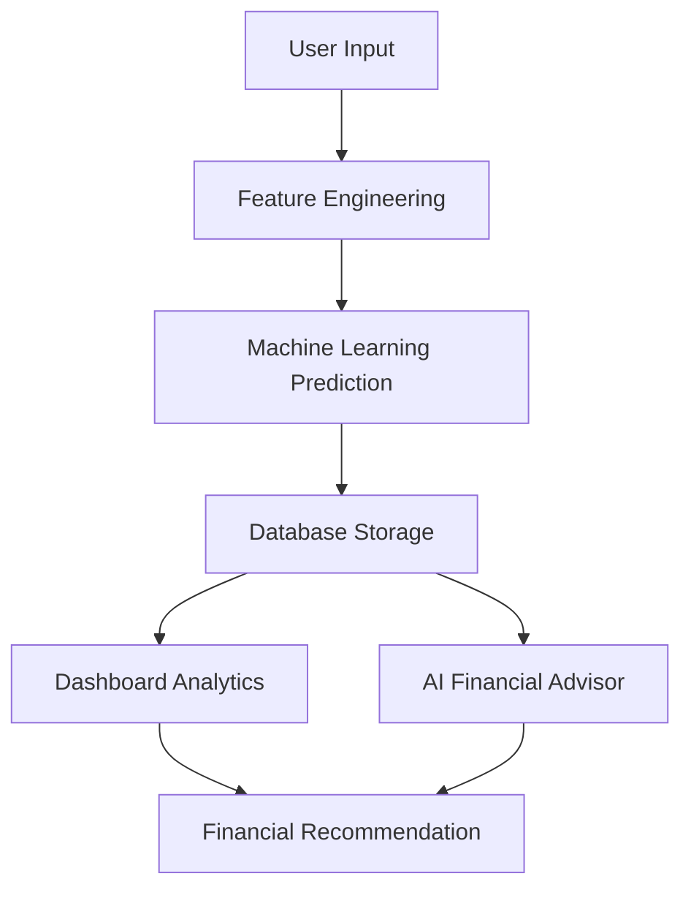

# FINWISE 💰

FINWISE adalah aplikasi Personal Finance Intelligence berbasis Artificial Intelligence dan Machine Learning yang membantu pengguna menganalisis kondisi keuangan, memantau kesehatan finansial, menetapkan target keuangan, serta memperoleh rekomendasi yang dipersonalisasi.

## Highlights

- User registration, login, dan session management
- Financial risk assessment berbasis Machine Learning
- Dashboard analitik untuk health score, tren, dan histori prediksi
- AI Financial Advisor dengan knowledge base dan riwayat chat
- Financial goals tracker dan emergency fund planner
- PDF report generator untuk ringkasan kondisi finansial

## Features

### Authentication

- User Registration
- User Login
- Session Management
- Profile Page

### Financial Risk Assessment

- Analisis kondisi keuangan menggunakan Machine Learning
- Prediksi kategori risiko: Aman, Waspada, Berbahaya
- Penyimpanan hasil analisis ke database

### Dashboard Analytics

- Financial Health Score
- Debt Ratio Analysis
- Saving Rate Analysis
- Risk Distribution
- Trend Analysis
- Prediction History

### AI Financial Advisor

- AI Chat Assistant
- Personalized Recommendation
- Knowledge Base (RAG)
- Persistent Chat History

### Financial Planning

- Financial Goals Tracker
- Emergency Fund Planner
- Goal Progress Monitoring

### Reporting

- PDF Financial Report
- Financial Summary Generator

## Technology Stack

### Frontend

- Streamlit

### Backend

- Python

### Database

- MySQL

### Machine Learning

- Scikit-Learn
- Random Forest Classifier

### AI

- Groq API
- Retrieval Augmented Generation (RAG)

### Reporting

- ReportLab

## Machine Learning Features

Model FINWISE menggunakan indikator finansial berikut:

- Umur
- Pendapatan bulanan
- Pengeluaran bulanan
- Total tabungan
- Total utang
- Jumlah tanggungan
- Debt ratio
- Expense ratio
- Saving rate

Output klasifikasi:

- Aman
- Waspada
- Berbahaya

## System Workflow



## Project Structure

```text
finwise/
├── README.md
├── docs/
│   ├── architecture.md
│   ├── database.md
│   ├── machine_learning.md
│   ├── ai_advisor.md
│   └── features.md
├── app.py
├── db.py
├── ai_service.py
├── financial_score.py
├── emergency_fund.py
├── goal_advisor.py
├── knowledge_loader.py
├── langchain_service.py
├── report_generator.py
├── pages/
│   ├── 1_Register.py
│   ├── 2_Login.py
│   ├── 2_Dashboard.py
│   ├── 3_AI_Advisor.py
│   ├── 4_Profile.py
│   └── 5_Financial_Goals.py
├── ml/
│   ├── predict.py
│   └── train_model.py
├── models/
├── data/
└── knowledge/
```

## Future Development

- Vector database integration
- Advanced RAG pipeline
- Investment recommendation
- Financial forecasting
- Mobile application version

## Author

Developed by Fara Rahmasari Fahirun.
