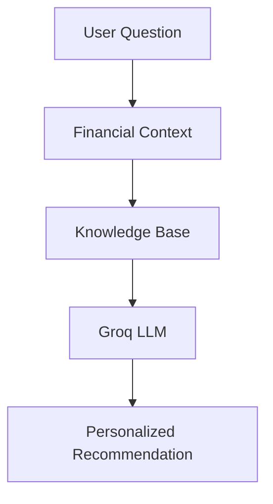

# AI Financial Advisor

## Purpose

Provide personalized financial recommendations based on user history, financial metrics, and a curated knowledge base.

## Components

### Financial Context

Generated from:

- Prediction history
- Financial health score
- Debt ratio
- Saving rate
- Risk category
- Recent analysis records

### Knowledge Base

Contains guidance related to:

- Budgeting
- Debt management
- Emergency fund planning
- Saving strategy

### Large Language Model

Groq API is used to generate conversational financial recommendations.

## Workflow

## Persistent Chat History

Every message is stored in the database so the AI Advisor can:

- Resume previous conversations
- Use recent user context
- Provide continuity across sessions

## Example Questions

- Dana darurat saya sebaiknya berapa?
- Bagaimana kondisi keuangan saya?
- Apa kelemahan terbesar kondisi keuangan saya?
- Bagaimana cara meningkatkan saving rate saya?
