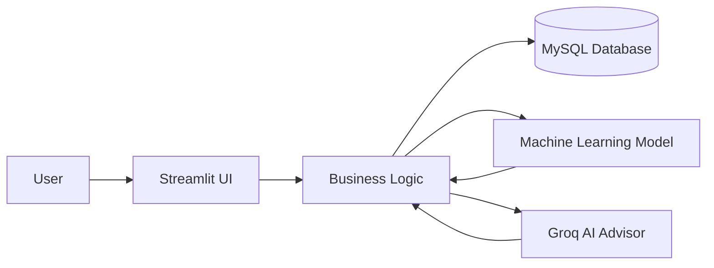
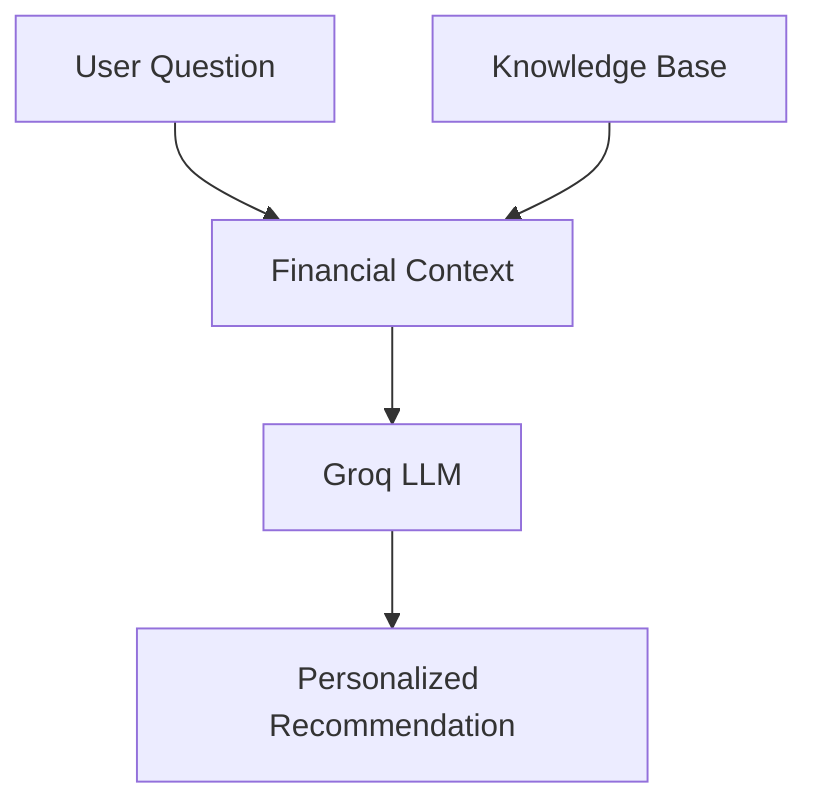
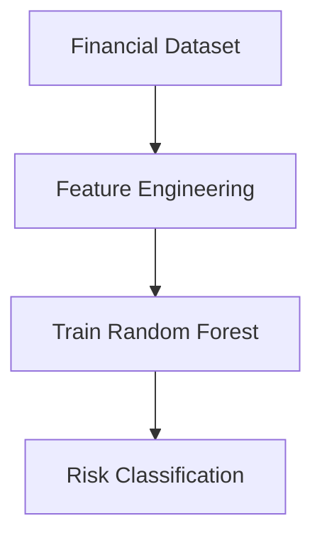

# System Architecture

## Overview

FINWISE is built using a three-layer architecture:

1. Presentation Layer
2. Business Logic Layer
3. Data Layer

## Architecture Diagram

## Presentation Layer

Implemented using Streamlit.

Main pages:

- Login
- Register
- Dashboard
- AI Advisor
- Financial Goals
- Profile

## Business Logic Layer

Contains the application logic used across pages:

- Financial Health Score calculation
- Emergency fund calculation
- Goal recommendation planning
- Machine learning prediction
- AI recommendation generation
- Report generation

## Data Layer

Implemented using MySQL.

Main data areas:

- User accounts
- Prediction history
- Chat history
- Financial goals

## AI Architecture

The AI advisor combines:

- User prediction history
- Financial health score
- Debt ratio and saving rate trends
- Knowledge base documents about budgeting, debt, saving, and emergency funds

## Machine Learning Architecture

The model is trained using financial indicators such as income, expense, savings, debt, dependents, and ratio-based features.
