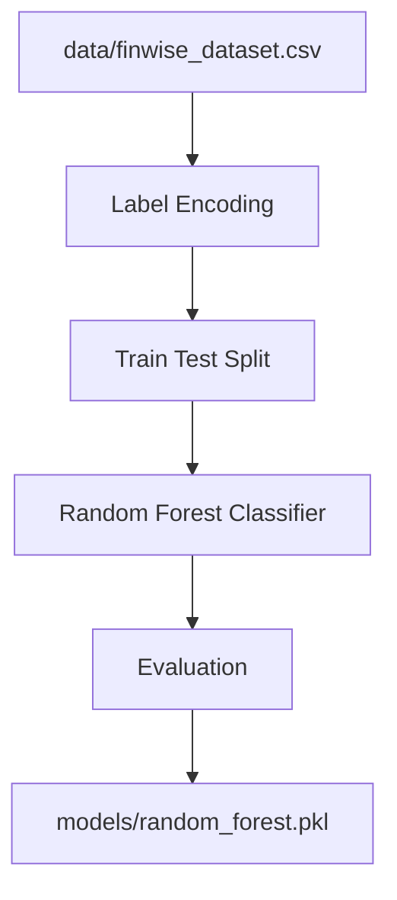

# Machine Learning Module

## Objective

Predict user financial risk level based on financial and demographic features.

## Algorithm

Random Forest Classifier

Why this model is used:

- Handles non-linear relationships well
- Performs strongly on classification tasks
- Robust against overfitting when tuned properly
- Easy to retrain and evaluate

## Input Features

The training pipeline uses the following features:

- umur
- pendapatan_bulanan
- pengeluaran_tetap
- tabungan_total
- total_utang
- jumlah_tanggungan
- debt_ratio
- expense_ratio
- saving_rate

## Output Classes

- Aman
- Waspada
- Berbahaya

## Feature Engineering

### Debt Ratio

Debt Ratio = Total Debt / Monthly Income

### Expense Ratio

Expense Ratio = Monthly Expense / Monthly Income

### Saving Rate

Saving Rate = Total Savings / Monthly Income

## Training Pipeline

## Evaluation Metrics

The model is evaluated using:

- Accuracy
- Precision
- Recall
- F1 Score
- Confusion Matrix

## Prediction Flow

1. User enters financial input in the main app.
2. Ratios are calculated from the raw inputs.
3. The model predicts risk class.
4. The result is saved to `prediction_history`.
5. Dashboard and AI Advisor use the stored predictions for analysis.
